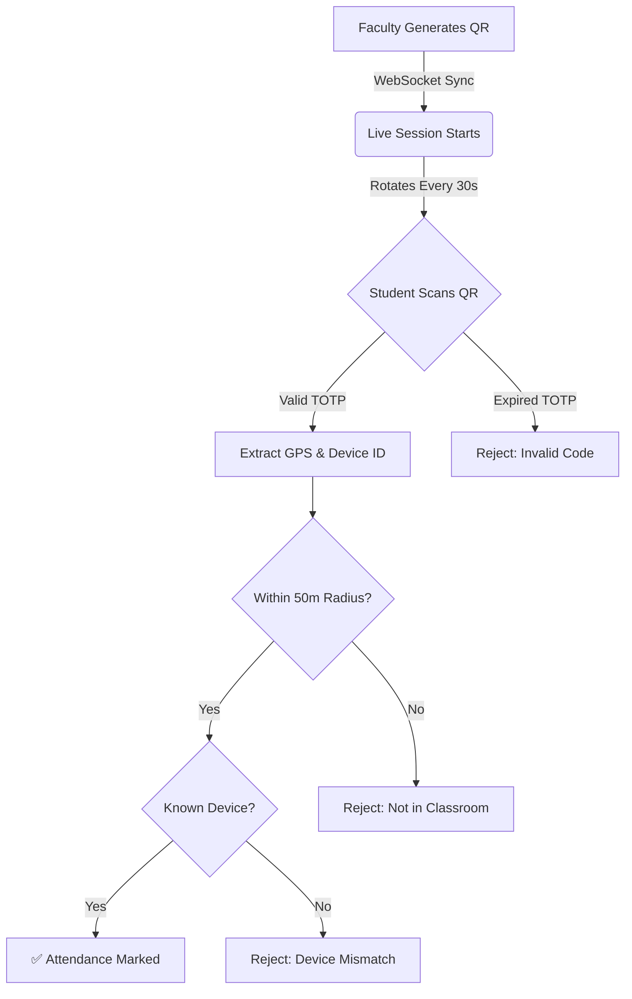

<div align="center">
  
  
  # 🎯 QRCodeAttend
  **The Next-Generation, Proxy-Free Attendance Management System**
  
  [](https://qrcodeattend-4qp8.onrender.com)
  [](https://qrcodeattend-backend-9y9u.onrender.com/api/docs)
  [](LICENSE)
</div>

---

## 🌍 Live Environments
Experience the full application live:
- **Frontend App:** [https://qrcodeattend-4qp8.onrender.com](https://qrcodeattend-4qp8.onrender.com)
- **Backend API:** [https://qrcodeattend-backend-9y9u.onrender.com](https://qrcodeattend-backend-9y9u.onrender.com)

---

## ⚡ Overview

**QRCodeAttend** completely re-engineers how educational institutions and corporate environments track attendance. By leveraging real-time WebSockets, **Time-Based Rotating QR Codes (TOTP)**, **GPS Geo-Fencing**, and **Device Fingerprinting**, it achieves **100% proxy-free** attendance. 

Gone are the days of buddy-punching, screenshot sharing, or WhatsApp QR code forwarding.

---

## 🛡️ The Anti-Proxy Architecture



---

## ✨ Enterprise-Grade Features

### 🏢 Multi-Tier Architecture
| Module | Features |
|--------|----------|
| **Admin Portal** | System-wide analytics, department & course management, user role assignment (RBAC), and full audit logging. |
| **Faculty Portal** | Create dynamic sessions, project rotating QR codes, view real-time incoming attendance streams, and export reports (PDF/Excel). |
| **Student Portal** | Scan live QR codes, track attendance history, view course-wise analytics, and receive automated low-attendance warnings. |

### 🔒 Security Implementations
- **Rotating QR Codes:** The QR data payload changes every 30 seconds. A screenshot taken by a student becomes invalid almost immediately.
- **Geo-Fencing:** Students must allow location access. The system calculates the Haversine distance between the student and the faculty's device.
- **Device Fingerprinting:** Binds a student's account to their physical smartphone to prevent one student from bringing multiple phones.

### 🎨 State-of-the-Art UI/UX
- **Glassmorphism Design:** Beautiful, semi-transparent frosted glass UI components.
- **Dynamic Theming:** Role-aware ambient gradients (Indigo for Admin, Cyan for Faculty, Emerald for Student).
- **Smooth Animations:** Powered by Framer Motion for liquid-smooth page transitions.

---

## 🛠️ Technology Stack

| Layer | Technologies |
|-------|--------------|
| **Frontend** | React 19, Vite, Tailwind CSS, Framer Motion, Zustand (State), React Query, Chart.js, HTML5-QRCode |
| **Backend** | Node.js, Express.js, Socket.IO, JWT Auth, Bcrypt, PDFKit, ExcelJS |
| **Database** | MongoDB Atlas, Mongoose ODM |
| **Deployment** | Render (Static Site + Web Service), Docker ready |

---

## 🚀 Local Development Guide

### Prerequisites
- Node.js `v18+`
- MongoDB Atlas cluster (or local instance)

### 1️⃣ Backend Setup
```bash
# Clone the repository
git clone https://github.com/rajayush6200/QRCodeAttend.git
cd QRCodeAttend/backend

# Install dependencies
npm install

# Create environment file
cp .env.example .env
```
*Configure your `.env` file with your `MONGODB_URI` and `JWT_SECRET`.*
```bash
# Start the development server
npm run dev
```
*(Backend runs on http://localhost:5000)*

### 2️⃣ Frontend Setup
```bash
# Open a new terminal
cd QRCodeAttend/frontend

# Install dependencies
npm install

# Start the Vite development server
npm run dev
```
*(Frontend runs on http://localhost:5173)*

---

## 📸 Application Showcase

> *Note: UI features responsive Glassmorphism and dark mode.*

1. **Intelligent Dashboards:** Real-time metrics and dynamic data visualizations.
2. **Live QR Projection:** Full-screen optimized QR projection for classroom displays.
3. **Seamless Scanning:** Mobile-optimized, rapid QR scanning interface with instant haptic feedback.

---

## 🤝 Contributing
Contributions make the open source community such an amazing place to learn, inspire, and create. Any contributions you make are **greatly appreciated**.

1. Fork the Project
2. Create your Feature Branch (`git checkout -b feature/AmazingFeature`)
3. Commit your Changes (`git commit -m 'Add some AmazingFeature'`)
4. Push to the Branch (`git push origin feature/AmazingFeature`)
5. Open a Pull Request

## 📝 License
Distributed under the MIT License. See `LICENSE` for more information.

<div align="center">
  <p>Built with ❤️ for modern education systems.</p>
</div>
